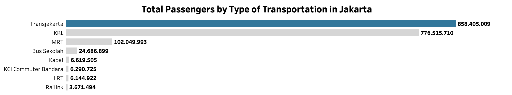
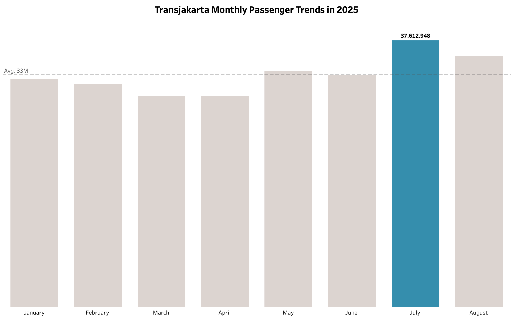

# Introduction
🏙️ As Indonesia’s administrative and economic center, Jakarta depends heavily on efficient public mobility. This project aims to explore Jakarta’s public transportation landscape by analyzing the available transport modes 🚈 🚎, passenger counts across different time periods 📈, and the number and locations of bus stops 🚏. All analyses are conducted using SQL to provide a clear and structured overview of Jakarta’s public transport system.

🔍 SQL queries? Check them out here: [sql folder](sql)

# Background
The recent discussion about a possible fare increase 💰 for Transjakarta raised an interesting question: how important is Transjakarta compared to other public transportation options in Jakarta? This project explores that question by using SQL to analyze transport types, passenger numbers, and the distribution of bus stops, providing a clearer view of Transjakarta’s role in supporting daily mobility across the city.

### 🔍 The questions that I wanted to answer through my SQL queries were:

1.	List the types of public transportation in the daily passengers data table!
2.	What is the total number of passengers for each type of public transportation?
3.	How does the number of passengers for MRT, KRL and LRT transportation compare in 2024?
4.	Create a running total for each year for the transjakarta public transportation mode!
5.	What is the trend for monthly transjakarta passengers in 2025?
6.	Count the number of transjakarta bus stops by region!
7.	List the subdistricts that have more than 10 transjakarta bus stops!
8.	List the names of transjakarta bus stops in the Setiabudi subdistrict!

# Tools I Used
-	**SQL:** The backbone of my analysis, allowing me to query the database and unearth critical insights
-	**MySQL:** The database management system I chose
-	**Microsoft Excel:** To prepare and clean data from the data source for this project
-	**Tableau:** Create simple visualizations from query result
-	**Git & GitHub:** Essential for version control and sharing my SQL scripts and analysis, ensuring collaboration and project tracking

# Data Preparation & Cleaning

The dataset used in this project was obtained from the [Satu Data Jakarta](https://satudata.jakarta.go.id/home), sourced from **Dinas Perhubungan** and **Badan Pembinaan Badan Usaha Milik Daerah.** It includes information on transportation modes, passenger counts and bus stops location, which was further processed for analytical purposes.

Before moving on to the analysis, the dataset was cleaned and organized using Microsoft Excel. This process included **removing rows with zero values, NULL entries, and data that was not relevant to the analysis**. Each column was also **standardized to ensure consistency, including aligning category names** that previously appeared in different variations. After these steps, the dataset became much cleaner and ready for analysis.

# The Analysis

### 1. List the types of public transportation in the daily passengers data table!
To identify the different types of public transportation modes available in Jakarta, I performed an initial data exploration by extracting the unique values from the `jenis_moda` column.

```sql
SELECT DISTINCT 
	jenis_moda
FROM 
	daily_passengers
ORDER BY
	jenis_moda;
```
**Table of types of public transportation modes in Jakarta**
| Jenis Moda  			|
|-----------------------|
| Bus Sekolah   		|
| Kapal        			|
| KCI Commuter Bandara	|
| KRl         			|
| LRT         			|
| MRT         			|
| Railink         		|
| Transjakarta         	|

The query results show that there are **8 types public transportation** recorded in the dataset.

### 2. What is the total number of passengers for each type of public transportation?
To determine which public transportation mode has the highest number of passengers, I performed an aggregation using the `SUM function` and grouped the data by `jenis_moda` column.

```sql
SELECT
	jenis_moda,
    SUM(jumlah_penumpang_per_hari) AS total_penumpang
FROM
	daily_passengers
GROUP BY
	jenis_moda
ORDER BY
	total_penumpang DESC;
```

*Barh graph visualizing for the total passengers by type of transportation in Jakarta. I used Tableau for created this graph from my SQL query results*

Based on the data from January 2023 to August 2025, Transjakarta stands out as the most widely used mode of transportation, with a total of more than 858 million passengers. It is followed by MRT and KRL, which rank second and third in terms of total passengers.

### 3. How does the number of passengers for MRT, KRL and LRT transportation compare in 2024?
Now, let’s take a look at how ridership compares across rail-based transportation modes. For this part of the analysis, I used the `SUM function` to calculate total passengers and applied filters by `year` and `jenis_moda`.

```sql
SELECT
	YEAR(tanggal) AS tahun,
    jenis_moda,
    SUM(jumlah_penumpang_per_hari) AS total_penumpang
FROM
	daily_passengers
WHERE
	YEAR(tanggal) = 2024
    AND jenis_moda IN ('MRT', 'LRT', 'KRL')
GROUP BY
    jenis_moda,
    YEAR(tanggal)
ORDER BY
	total_penumpang DESC;
```

**Table of comparation number of passangers for MRT, KRL & LRT in 2024**
| Tahun| Jenis Moda | Total Penumpang |
|------|------------|-----------------|
| 2024 | KRL        | 325,243,803     |
| 2024 | MRT        | 40,010,400      |
| 2024 | LRT        | 1,212,984       |

The results show that **KRL has the highest ridership** among rail-based modes, surpassing both the MRT and LRT Jakarta. This makes sense because KRL covers a much wider area, serving not only Jakarta but also nearby cities like Bogor, Depok, Tangerang and Bekasi. With such broad coverage, it's natural that KRL attracts a significantly larger number of passengers.

### 4. Create a running total for each year for the transjakarta public transportation mode!
This question helps us understand how Transjakarta’s ridership grows from year to year. To answer it, I used a `CTEs (Common Table Expressions)` and `Window functions` to calculate a running total of the available data.

```sql
WITH total_tahunan AS (
	SELECT
		YEAR(tanggal) AS tahun,
        jenis_moda,
        SUM(jumlah_penumpang_per_hari) AS total_penumpang_per_tahun
	FROM
		daily_passengers
	GROUP BY
        YEAR(tanggal),
        jenis_moda
)

SELECT
    tahun,
    jenis_moda,
    total_penumpang_per_tahun,
    SUM(total_penumpang_per_tahun) OVER (
		ORDER BY tahun
        ROWS BETWEEN UNBOUNDED PRECEDING AND CURRENT ROW
	) AS running_total
FROM
	total_tahunan
WHERE
	jenis_moda = 'Transjakarta'
ORDER BY
	tahun;
```
**Table of running total number of passngers for Transjakarta from January 2023 - August 2025**
| Tahun|  Jenis Moda   | Total Penumpang per Tahun | Running Total |
|------|---------------|---------------------------|---------------|
| 2023 | Transjakarta  | 214,016,133     		   | 214,016,133   |
| 2024 | Transjakarta  | 382,073,717     		   | 596,089,850   |
| 2025 | Transjakarta  | 262,315,159     		   | 858,405,009   |

The results show a clear upward trend: Transjakarta’s annual ridership continues to **grow significantly**. **Interestingly, even though the data for 2025 only covers up to August, the total ridership has already surpassed the entire ridership recorded in 2023**. This highlights the strong and consistent growth in Transjakarta usage over recent years.

### 5. What is the trend for monthly transjakarta passengers in 2025?
Let’s see how the number of Transjakarta passengers trend in 2025

```sql
WITH total_bulanan_2025 AS (
	SELECT
		MONTH(tanggal) AS bulan,
        jenis_moda,
        SUM(jumlah_penumpang_per_hari) AS total_penumpang_per_bulan
	FROM
		daily_passengers
	WHERE
		YEAR(tanggal) = 2025
	GROUP BY
        MONTH(tanggal),
        jenis_moda
)

SELECT
    bulan,
    jenis_moda,
    total_penumpang_per_bulan
FROM
	total_bulanan_2025
WHERE
	jenis_moda = 'Transjakarta'
ORDER BY
	bulan;
```


*Bar graph visualizing for the transjakarta monthly passenger trends in 2025. I used Tableau for created this graph from my SQL query results*

During 2025, Transjakarta had an average of 33 million passengers per month. The highest number occurred in July during the school holidays. This shows that Transjakarta is the preferred mode of transportation during the holiday season.

### 6. Count the number of transjakarta bus stops by region!
This question helps us see the distribution of Transjakarta bus stops based on their location.

```sql
SELECT
	wilayah,
    COUNT(wilayah) AS total_halte
FROM
	halte_transjakarta
GROUP BY
	wilayah
ORDER BY
	total_halte DESC;
```
**Table of the number of Transjakarta bus stops by region**
|    Wilayah    | Total Halte |
|---------------|-------------|
| Jakarta Timur | 68          |
| Jakarta Selatan | 65        |
| Jakarta Pusat | 58          |
| Jakarta Barat | 41          |
| Jakarta Utara | 26          |
| Kota Bekasi   | 7           |
| Kota Tangerang | 68         |
| Bekasi 		| 1           |

We can see that Transjakarta not only operates in Jakarta, but also in areas outside Jakarta such as Bekasi and Tangerang. This is in line with its role in helping people outside Jakarta who work and carry out activities in Jakarta.

### 7. List the subdistricts that have more than 10 transjakarta bus stops!
To find subdistricts with more than 10 bus stops, we can use the `HAVING function` to filter the `SUM aggregation` we have created.

```sql
SELECT
	wilayah,
    kecamatan,
    COUNT(kecamatan) AS total_halte_per_kecamatan
FROM
	halte_transjakarta
GROUP BY
	wilayah,
    kecamatan
HAVING
	total_halte_per_kecamatan > 10
ORDER BY
	total_halte_per_kecamatan DESC;
```

**Table of the subdistricts with more than 10 Transjakarta Bus Stops**
|    Wilayah    |  Kecamatan  | Total Halte per Kecamatan |
|---------------|-------------|---------------------------|
| Jakarta Timur | Jatinegara  | 18 						  |
| Jakarta Timur | Pulo Gadung  | 18 					  |
| Jakarta Selatan | Setiabudi | 16 						  |
| Jakarta Pusat | Tanah Abang | 13 						  |
| Jakarta Utara | Tanjung Priok | 13 					  |
| Jakarta Pusat | Senen       | 12 						  |
| Jakarta Pusat | Gambir      | 11 						  |
| Jakarta Selatan | Kebayoran Lama | 11 				  |

The subdistricts of **Jatinegara, Pulo Gadung, and Setiabudi** have the highest number of bus stops.

### 8. List the names of transjakarta bus stops in the Setiabudi subdistrict!
Let's take a look at the names of bus stops in the Setiabudi area, which is an elite area in Jakarta.

```sql
SELECT
	nama_halte
FROM
	halte_transjakarta
WHERE
	kecamatan = 'Setiabudi'
ORDER BY
	nama_halte;
```
**Table of the names of transjakarta bus stops in the Setiabudi subdistrict**
| Nama Halte  						 |
|------------------------------------|
| Denpasar Arah Timur   			 |
| Galunggung         				 |
| Halimun							 |
| Karet Kuningan         			 |
| Kuningan        					 |
| Kuningan Madya         			 |
| Manggarai         				 |
| Pasar Rumput         				 |
| Patra Kuningan         			 |
| Rasuna Said         				 |
| Semanggi         					 |
| Setiabudi         				 |
| Simpang Kuningan         			 |
| Tegal Parang Arah Timur         	 |
| Underpass Kuningan         		 |
| Widya Chandra Telkomsel Arah Timur |


# What I Learned
Through this project, I was able to apply several SQL skills, including:

- **📊 Data Aggregation:** Using GROUP BY along with aggregate functions such as SUM and COUNT to summarize data based on analytical needs
- **🪟 Window Function:** Allowing me to perform calculations across related rows without reducing the number of returned rows—for example, creating a running total as implemented in this project
- **🧩 CTEs (Common Table Expressions):** Helping simplify complex queries, making them easier to read, understand, and maintain

# Conclusions

### 💡Insight
From the analysis, several general insight emerged:

1. **🚎 Transjakarta consistently leads in ridership:** From January 2023 to August 2025, Transjakarta remained the most widely used public transport mode with more than 858 million total passengers and continued to show strong year-over-year growth. Notably, the 2025 ridership (up to August) has already surpassed the entire total recorded in 2023.
2. **📈 Monthly patterns highlight mobility behavior:** In 2025, Transjakarta recorded an average of 33 million passengers per month, with the peak occurring in July during school holidays. This indicates that Transjakarta becomes the preferred option during high mobility periods.
3. **🌇 Network expansion enhances regional accessibility:** Transjakarta operates not only within Jakarta but also in surrounding areas such as Bekasi and Tangerang, supporting daily commuters. Subdistricts like Jatinegara, Pulo Gadung, and Setiabudi have the highest number of bus stops, showing areas with the greatest access and demand.

### Closing Thoughts
This project provides a comprehensive overview of Transjakarta’s role in supporting Jakarta’s urban mobility over the past three years. Through data analysis and visualization, it highlights total passengers growth, evolving transportation patterns, and the importance of stop distribution in improving accessibility. Ultimately, this project not only strengthened my skills in SQL, data analysis, and visualization but also demonstrated how data can be effectively used to understand and evaluate urban transportation needs.
